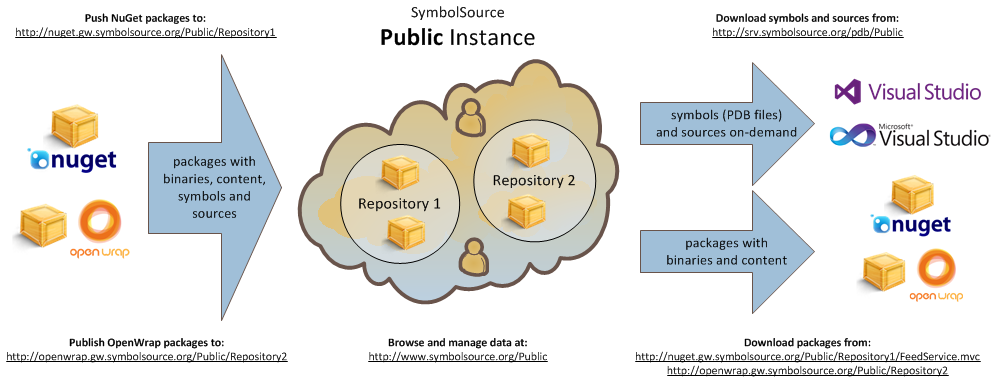
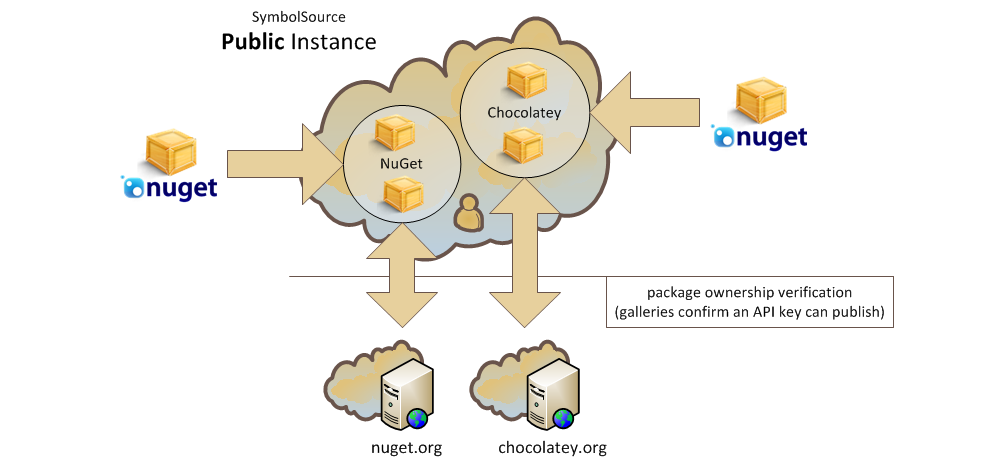
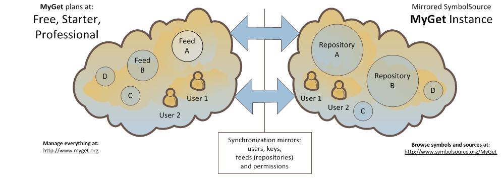

## SymbolSource instances a.k.a company accounts

The first thing that you need to know is that SymbolSource is based on instances with separate user databases. These are also known as company accounts, because their main purpose is to provide indepenetent symbols and source servers in cloud, software-as-a-service offering.

Unless you decide to subscribe to one of our commercial plans, most of the time you'll be using be [Public](http://www.symbolsource.org/Public) instance, where you can register a private account for youself, or the [MyGet](http://www.symbolsource.org/MyGet) instance, which shares users with [myget.org](http://myget.org).

## Inputs and outputs, plugs and sockets

SymbolSource consumes NuGet and OpenWrap packages and stores their content while indexing symbols and sources for later on-demand access. These are all stored in repositories, which have separate package (project) namespaces. The diagram below illustrates fictional repositories 1 and 2.

SymbolSource Public accepts packages at URLs constructed the following way:

 * using NuGet to push: `http://nuget.gw.symbolsource.org/Public/Repository1`
 * using OpenWrap to push: `http://openwrap.gw.symbolsource.org/Public/Repository2`
 
[Learn more about the methods, tools and best practises of publishing to SymbolSource](Publishing)
 
 When you want Visual Studio to get symbols and sources included in those packages, you need to point it to:
 
* the anonymous debugging URL, which skips projects with restricted access: `http://srv.symbolsource.org/pdb/Public`,
* an authenticated URL, which you can learn more about by clicking the link below.
 
[Learn more about configuring Visual Studio and using SymbolSource during debugging](Using)

Because SymbolSource can also serve NuGet and OpenWrap packages, you can also use the following URLs:

 * with NuGet to get packages: `http://nuget.gw.symbolsource.org/Public/Repository1/FeedService.mvc`
 * with OpenWrap to get wraps: `http://openwrap.gw.symbolsource.org/Public/Repository2`

**Note that packages downloaded from SymboSource will not contain any symbols or sources. These are stripped away and stored separately for serving with the SRCSRV protocol on-demand.** This means that you can push an all-in-one package once to SymbolSource and have everything set up for the best experience: with binary-only packages for referencing and symbols/sources available on-demand during debugging.

[Learn more about using SymbolSource as a package store with NuGet and OpenWrap](Packages)

## Repositories available in the Public instance

There are a couple of main repositories available at SymbolSource.org. These repositories are all open for read access, but pushing packages requires additional permissions - and more on that later.

* **[Default](http://www.symbolsource.org/Public/Metadata/Default)** - This is now mostly a historic repository. In the beginning symbol and source uploads where done through a web form taking a regular ZIP file. Third-party uploads were rare so most of the time we just created those ZIP files ourselves and uploaded them to the [Default](http://www.symbolsource.org/Public/Metadata/Default) repository. If there are any of you still refusing to jump on the package manager bandwagon, you can have us store symbols in that repository even today, e.g. for binaries published by some old-school method like a POZFWS (Plain Old Zip File on a Web Site). Maybe we'll even enable our old upload form again?

* **[NuGet](http://www.symbolsource.org/Public/Metadata/NuGet)** - This is where `nuget.exe` pushes to automatically, when it detects that a symbol package is present. Pushing is only possible if you are listed an owner of a given project on [nuget.org](http://nuget.org).

* **[OpenWrap](http://www.symbolsource.org/Public/Metadata/OpenWrap)** - OpenWrap users claim wrap names colliding with NuGet packages, so there is a separate repository for this tool. You can push here directly, as there is no other central OpenWrap host available at the moment, no equivalent of  [nuget.org](http://nuget.org).

* **[Chocolatey](http://www.symbolsource.org/Public/Metadata/OpenWrap)** - as mentioned on one of our blogs, SymbolSource can be used not only for debugging libraries, but also actual applications. This repository syncs its permissions with [chocolatey.org](http://chocolatey.org). Learn more about publishing debuggable open-source applications with Chocolatey and SymbolSource in this post: [A world of debuggable open-source software – Part 3: Applications](http://tripleemcoder.wordpress.com/2012/09/03/a-world-of-debuggable-open-source-software-part-3-applications/).

## Private repositories and the permission model in detail

From the previous point you now know that SymbolSource can provide separate repositories and that some they can be associated with NuGet galleries like [nuget.org](http://nuget.org) and [chocolatey.org](http://chocolatey.org) to share permissions.

If you have an account on [symbolsource.org](http://www.symbolsource.org) you can also create your own private repositories, which will be prefixed with your user name to make them unique. In that case you have total control over read and write access - you can grant those rights using our website to any other user of SymbolSource (or to the **public** user, which makes them available without authentication, exactly like all the repositories listed in the previous point.). You can create a private account at any time by filling out the [registration form](http://www.symbolsource.org/Public/Account/Register). Once logged in to SymbolSource, you can create a new private repository by going to the [Metadata](http://www.symbolsource.org/Public/Metadata) page.

With SymbolSource, permissions are tracked up to the level of a project (package) version, which means that you can let someone else only access stable releases, or even use SymbolSource as a secure means of distribution of libraries sold commercially.

[Learn more about controlling permissions with the SymbolSource API](API)

## Integration with package galleries

When you publish symbol packages to our NuGet endpoint, which is `http://nuget.gw.symbolsource.org/Public/NuGet`, you are pushing to the [Public](http://www.symbolsource.org/Public) instance and [NuGet](http://www.symbolsource.org/Public/Metadata/NuGet) repository. You could also push to your own repository with an URL like this: `http://nuget.gw.symbolsource.org/Public/Private.TripleEmcoder.Secret`, but be sure to create it on the website first.

Whereas a private repository is under your control, the [NuGet](http://www.symbolsource.org/Public/Metadata/NuGet) repository is configured to verify permissions with [nuget.org](http://nuget.org) on each upload - using the API key supplied by the user on the `nuget.exe push` command-line. You are only allowed to push if [nuget.org](http://nuget.org) confirms that the API key belongs to an account listed as one of the package owners.

An interesting feature is that you don't even need to create an account on [symbolsource.org](http://www.symbolsource.org) to push NuGet symbol packages - we'll create one for you automatically, but since we can't figure out your user name from the upload alone, and we won't ask [nuget.org](http://nuget.org) to provide one for privacy reasons, this new account will have a generated name. At any time you are welcome to create a real account and [associate your API key](http://www.symbolsource.org/Public/Account/Authentication) - we'll move all your previous uploads under the new account automatically. Registering gives you the additional benefits of reviewing upload reports for possible symbol issues and managing package versions.

After uploading a symbol package with NuGet and [logging into SymbolSource](http://www.symbolsource.org/Public/Account/LogIn) you might notice that your package ownership is mirrored on the [Authorization page](http://www.symbolsource.org/Public/Account/Authorization). This allows you to browse upload reports for those projects, and also manage individual versions, by going to the [NuGet](http://www.symbolsource.org/Public/Metadata/NuGet) repository and hiding or deleting them. Hiding is similar to [nuget.org](http://nuget.org)'s unlisting - it removes a version from public display, but still allows symbols to be downloaded with Visual Studio.

All of this also applies to [chocolatey.org](http://chocolatey.org) and any other site based on the NuGet Gallery codebase - which can be associated with a private repository that you own, or any repository under a company account.

## Integration with MyGet

Because [myget.org](http://myget.org) is quite a different beast than [nuget.org](http://nuget.org), we also have a different integration model for it. To support multiple MyGet repositories, and a separate user base, SymbolSource hosts a [MyGet](http://www.symbolsource.org/MyGet) company that is managed by [myget.org](http://myget.org) using our API. Each MyGet user and repository automatically gets its counterpart on SymbolSource, so you don't need to do anything, apart from checking out [MyGet Feed Details](http://www.myget.org/Feed/List) to discover what your push URL for symbol packages is and how to configure Visual Studio to download PDBs from your repositories. Your account's API key will enable you to push to both MyGet and SymbolSource, just as with NuGet.

You can also share [MyGet](http://www.symbolsource.org/MyGet/Metadata) symbol repositories with others - just add other people under [MyGet Feed Security](http://www.myget.org/Feed/List) and our sync process will take care of the rest.

If you'd like to benefit from our website's features at the same time, just edit your [MyGet Profile](http://www.myget.org/Profile/Edit) to set up and password and after a moment you'll be able to log into [SymbolSource MyGet instance](http://www.symbolsource.org/MyGet/Account/LogIn)

There are already some prominent examples of public MyGet feeds making use of SymbolSource:

* The feed hosting plugins for [NuGet Package Explorer](http://npe.codeplex.com). You can learn more about how this works in this blog post: [A world of debuggable open-source software – Part 2: Plugins](http://tripleemcoder.wordpress.com/2012/09/01/a-world-of-debuggable-open-source-software-part-2-plugins/).
* The feed with ASP.NET Web Stack nightly builds, as described on [our blog](http://www.symbolsource.org/Public/Blog/View/2012-08-30/ASP_NET_Web_Stack_nightlies_now_also_on_SymbolSource) and in [their discussion group](http://aspnetwebstack.codeplex.com/discussions/393629).

## Company accounts in detail

A mentioned before, SymbolSource offers separate instances in a software-as-a-service model. These are also called company accounts and they can be created automatically by [simply filling out a form](http://www.symbolsource.org/Public/Account/Register).

Depending on the plan you choose, a company account will let you create even an unlimited number of arbitrarily named users and repositories. Soon we will also let you implement SSO with your own Active Directory infrastructure.

With a company account, all URLs contain its name instead of Public:

* the website is at `http://www.symbolsource.org/<company-name>`
* NuGet push URLs are at `http://nuget.gw.symbolsource.org/<company-name>/<repository-name>`
* NuGet package feeds are at `http://nuget.gw.symbolsource.org/<company-name>/<repository-name>/FeedService.mvc`
* OpenWrap repositories are at `http://openwrap.gw.symbolsource.org/<company-name>/<repository-name>`

## Other integration possibilities

As you can see our data model is quite flexible, and the fact that all the endpoints (website, NuGet, OpenWrap) are build around our APIs gives us a lot of possibilities. For example, we've always liked the idea of commercial third-party library and component vendors enabling source access using our platform instead of downloadable ZIP files. Our APIs allow adjusting symbol and source access in real-time from any e-commerce platform controlling sales and licencing. Feel free to contact us if you find this idea interesting. We'll be happy to explain it further and help in deploying a solution.